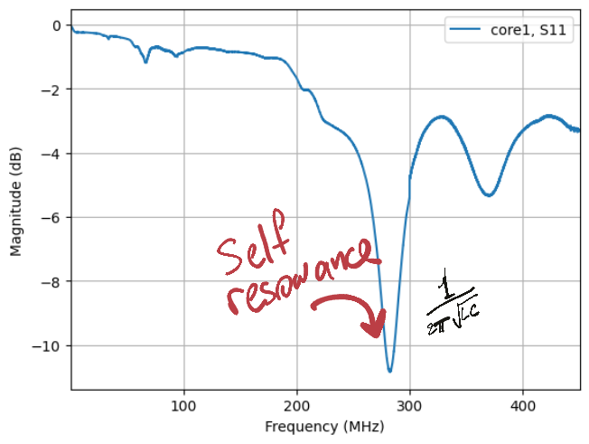

# Salvaged ferrite cores characterization

## Measure and compute
 **Take measurements of the core**

See [Jupyter notebook](./FerriteCore.ipynb)

## Theory
**Ferrite bead response characteristics**

Interesting findings

https://www.everythingrf.com/community/what-is-self-resonant-frequency

## References

https://owenduffy.net/blog/?p=16124
